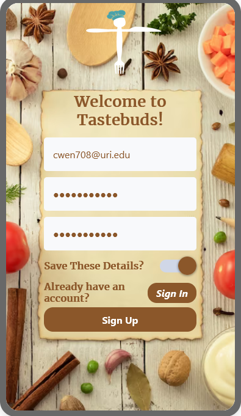
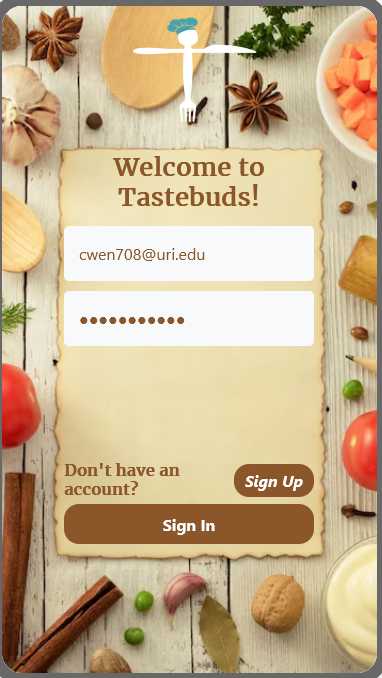
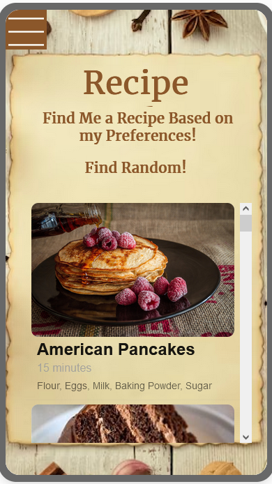
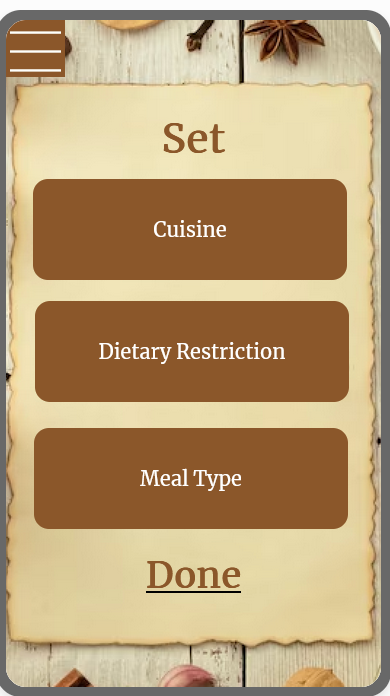
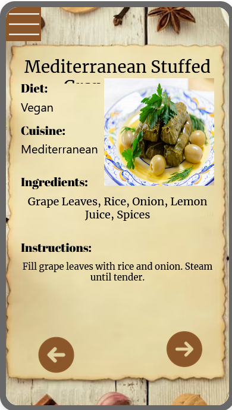
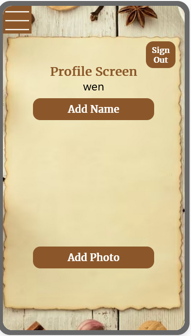
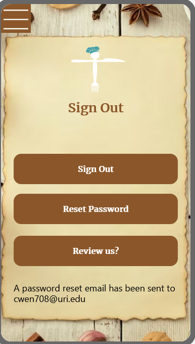
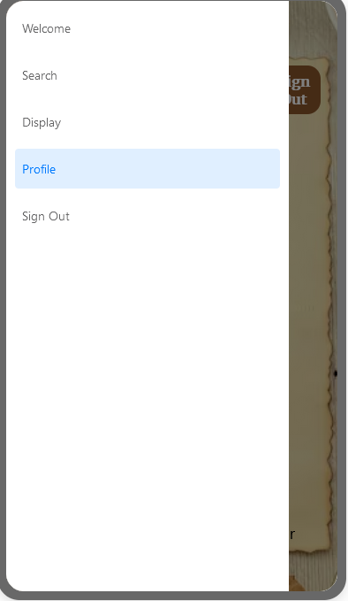

Hi,
Welcome to the instruction page.
This guide walks you through using the essential features of the TasteBuds,helping you get started quickly and efficiently.

**Step 1:** As a new User, you will have to use a Email address to register a account for Tastebuds.Tastebuds will send a verification Email to your Email Address and after you verify the Emaill Address your account will be ready to go!

**Step 2:** After user verify the Email Address, user can click the Sign in button and use the account information to Sign in.

**Step 3:** Here is the Mean page of our app, There are Two buttons and a list of recommand recipes.One is find me a recipe based on my preferences and the other one is Find Rnadom.

**Step 4:** When User click the Button "Find me a recipe based on my preferences", app will bring user to the preference screen and people can set up the preferences between Cuisine, Dietary Restriction,Meal Type.

**Step 5** After user done with the search the recipe, Tastebuds will take user to the Display screen, Here is the example of the recipe.

**Step 6:** User can set up their profile through Profile Screen. There are two features in this Screen, first is the Name, user can add the name also edit the name. Second is the Add photo, user can either take the photo using the camera or select from the photo library(only on andriod devices).

 

**Step 7:** When User click "sign out", there will be three buttons,Sign out,rest password and review us. When user click reset password, App will send a reset passowrd email to user's email. When user click review us, we will have a scale of 1 to 10 rating for user to choose.

**Step 8:** At the top left corner, We will have the list to access all screen, Also If user want to sign out, they can use the sign out bustton in the list as well.

## Video Walkthrough

